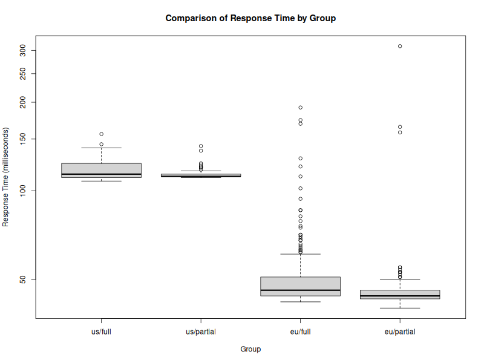

# Running Apache Bench against a Rails backend

<!-- markdown-toc start - Don't edit this section. Run M-x markdown-toc-refresh-toc -->
**Table of Contents**

- [Overview](#overview)
- [Repository Contents](#repository-contents)
- [Experiment Setup](#experiment-setup)
- [Experiment Procedure](#experiment-procedure)
- [Analysis and Results](#analysis-and-results)
    - [Boxplot Comparison of Response Times by Group](#boxplot-comparison-of-response-times-by-group)

<!-- markdown-toc end -->

## Overview

This repository contains the results and analysis of an experiment
conducted to compare the performance of two servers located in
different geographical regions: the United States and
Europe.

Moreover, it compares the impact between full (Full page) and partial
responses (Single Rails Turbo-Frame).

The experiment was conducted from a laptop situated in Berlin.

## Repository Contents

- `.csv:` Contains the raw data files generated from the experiment.
- `analyze.R`: R script for data analysis and visualization.
- `bench.sh`: Bash script to run the experiment.
- `README.md`: Provides an overview of the experiment and its results.

## Experiment Setup

The experiment involved four distinct groups, each representing a
combination of server location and the type of response. The groups
were structured as follows:

1. **US Server (Full Response)**: Server located in the United States
providing full response.
2. **US Server (Partial Response)**: Server located in the United
States providing partial response (Single Rails Turbo-Frame).
3. **Europe Server (Full Response)**: Server located in Europe
providing full response.
4. **Europe Server (Partial Response)**: Server located in Europe
providing partial response (Single Rails Turbo-Frame).

## Experiment Procedure

For each group, a series of HTTP requests were sent to the respective
server using Apache Bench (`ab`) with specific configurations. The
response times for each request were recorded and analyzed to compare
the performance of the servers under different conditions.

## Analysis and Results

The collected data was imported into R, outliers were removed, and the
cleaned dataset was then visualized using a boxplot to gain insights
into the distribution and comparison of response times across
different experimental conditions.

### Boxplot Comparison of Response Times by Group

